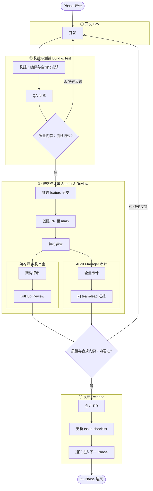

# Swift-developer 开发流程（DevSecOps 最佳实践）

## DevSecOps 最佳实践在本流程中的体现

| 实践 | 说明 |
|------|------|
| **管道阶段化** | 明确分为 ① 开发 → ② 构建与测试 → ③ 提交与评审 → ④ 发布，每阶段职责清晰，便于自动化与度量。 |
| **质量左移** | 构建（编译 + 自动化测试）和 QA 测试在提交 PR 之前执行，问题在本地/CI 尽早暴露，降低修复成本。 |
| **显式门禁** | 两处门禁：**质量门禁**（测试通过才提交）、**质量与合规门禁**（架构审查 + 审计均通过才合并），不通过即阻断并反馈。 |
| **安全与合规内建** | 评审阶段包含架构审查与全量审计，作为合规门禁的一部分，而非事后补做。 |
| **单一反馈回路** | 任一门禁不通过均回到 **开发**，统一由开发修复后从 **构建与测试** 重跑全管道，形成闭环。 |
| **快速反馈** | 门禁不通过时明确标注「快速反馈」回开发，强调缩短反馈周期、持续改进。 |

## 管道顺序摘要

- **① 开发**：实现或根据反馈修复。
- **② 构建与测试**：编译与自动化测试 → QA 测试 → 质量门禁；不通过则回开发。
- **③ 提交与评审**：推送 feature 分支 → 创建 PR 至 main → 并行评审（架构师架构审查 + Audit Manager 审计）→ 质量与合规门禁；不通过则回开发。
- **④ 发布**：合并 PR → 更新 Issue checklist → 通知进入下一 Phase。
